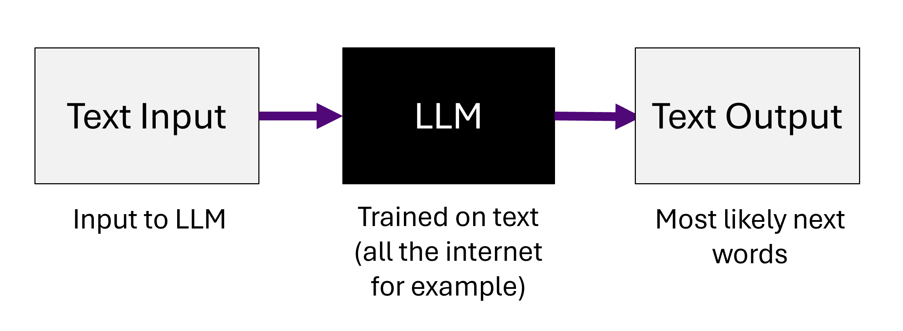
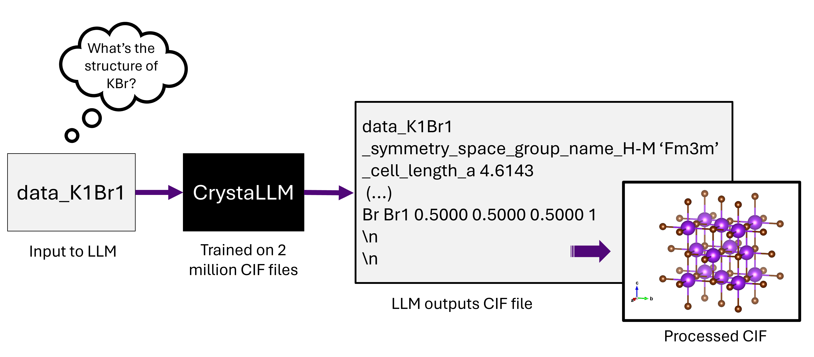
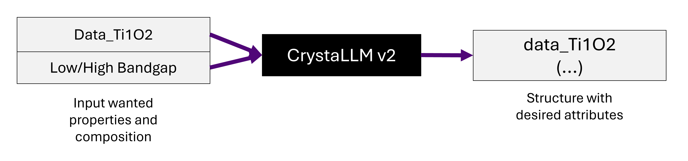

DFT Modelling of ML Generated Structures
=================

Welcome to the weeklong summer research project! I hope this week can give a flavor of what its like to be postgrad researcher (although I myself am figuring things out every day). 

I've made some google colab notebooks to help take you through the week and (hopefully) get some interesting results and new useful skills.

Don't worry if stuff doesnt work, thats part of research. Send me an email or come to my desk any time and hopefully I can help out!

The goal of this week is to help and figure out if some of the structures generated by a Machine Learning algorithm developed in this group are actually useful.

## What I've been doing the past year

### The Generative Model - CrystaLLM
The model used to generate structures is based on [CrystaLLM](https://arxiv.org/abs/2307.04340). To quickly summarize, the model is a large language model (LLM) based on GPT-2 architecture (older and smaller version of ChatGPT). 

 
  <em>Figure&nbsp;1 – Predicting some text with any LLM</em>

However, rather than being trained to answer questions by generating text word by word, it is trained to generate crystal structures in the form of a Crystalographic Information File (CIF), by generating the contents of the file step by step. Intuitively, its a bit like the auto-complete on our phones but instead of giving a next likely word or group of words, itd be what is the likely structure from an input atomic composition.
> **Note**: `If you dont know what a CIF file is, dont worry, we'll go through that in the notebook.

 
  <em>Figure&nbsp;2 – LLM architecture for crystal generation</em>

If you find LLMs confusing, thats ok, we wont be using them in this project, but if you're interested in reading more about them I can recommend a few blogposts like [this one](https://www.lakera.ai/blog/large-language-models-guide) or [another one - more in depth](https://jalammar.github.io/illustrated-gpt2/). I would return to this after the project if you are interested!

### Conditioning CrystaLLM

So the model already exists and its available to use. What I've been trying to do this year is try to edit the model so that it can try to generate a structure with a wanted property. Essentially, rather than just learning how to generate a structure from a given composition, we generate a structure from a given **composition** and **property**

 
  <em>Figure&nbsp;3 – LLM architecture for conditional crystal generation</em>

Now, this seems great - If the model worked perfectly, climate change could be solved!
Unfortunately, the way we build models and algorithms means that we make alot of assumptions and approximations along the way. 
>If you've used ChatGPT before, you know it can output complete rubbish. We'd like to avoid this as much as possible.

So we need more checks to see if the material we've generated is actually useful before we ask any one else to study its potential uses. Whats nice with LLMs is that oce a model is trained, we can generate a bunch of outputs rapidly, then we filter them down to see if theres anything useful.

### Evaluating our generated structures

To filter down the generated structures, we look at a few properties:

**Validity** (from CrystaLLM paper) - an output structure is said to be valid if: 
- The declared spacegroup is consistent with the generated structure
- The generated bond lengths are reasonable, and 
- The declared atom site multiplicity is consistent with the cell composition. 

**Novelty** - an output is novel if:
- The structure is has never been seen before by the LLM (it came up with something a new way to arrange the atoms!)

**Stability** - an output is stable if:
- The structure is energetically favorable. This one is often pretty tricky but we'll go through it in more depth this week.

**Property** - an output has interesting properties if:
- The properties it exhibits are close to what we wanted in the first place.

Generally, the first 2 properties are easy to screen and computationally inexpensive, so this is done first.

The next two are harder to compute and require some additional steps. We will go through this uring the week, but the main point to retain is: 

1. Once we have a set of **chemically sensible and novel materials**, we can use **cheap and inexpensive computations** to get a feel for which structures are interesting to look at 
> For example, in my workflow i use ML models specialised in calculating energies or bandgaps from a given structure. They're fast but often not super accurate. 

2. Then, we get the most promising 'candidates' and run heavier computations to judge them. 

 
  <em>Figure&nbsp;4 – The Materials Discovery Screening funnel (as we go down less and less materials pass the checks)</em>

**Its important to note that this is research in progress. Everything generated by the model could end up being useless - but thats an interesting result as well!**

## Alright, thats it for the intro! Lets get into it and see how were going to judge the candidate materials.

Here is the link for the google colab notebook you'll use throughout the week:

>You'll need to make a copy of the colab because this one is read only. Once youve copied a version into a google drive you can get started. 

## Need Help?

If you encounter any issues, or have any questions, please feel free to 
email me at cyprien.bone.24@ucl.ac.uk

